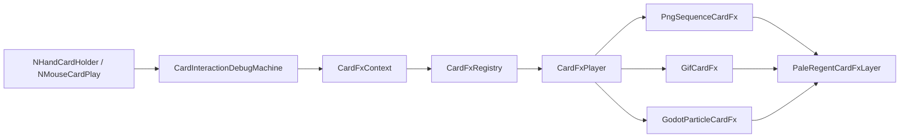

# CardFX 卡牌交互特效架构

CardFX 以 `CardInteractionDebugMachine` 为状态入口，将**卡牌类型、交互状态与动画定义**集中关联。状态机只识别 Hover、Selected、Played、Cancelled 等事件，具体动画节点的创建、定位、移动、淡入淡出、去重和回收全部交给 `CardFxPlayer`。这样新增卡牌特效时，不需要继续修改 Harmony Patch，也不会把资源路径和视觉参数散落到卡牌逻辑中。

## 1. 架构与职责



| 组件 | 主要职责 |
|---|---|
| `CardInteractionDebugMachine` | 捕获手牌悬停、拿起、取消和成功打出，保存同一次交互的卡牌中心、鼠标位置及视口尺寸。 |
| `CardFxContext` | 向特效提供稳定的卡牌、状态和空间上下文。 |
| `CardFxRegistry` | 按卡牌 `Type` 和 `CardFxState` 保存关联；支持基类关联继承。 |
| `CardFxCatalog` | 集中书写全部“哪张卡在哪个状态播放什么”的配置。 |
| `CardFxPlayer` | 管理统一 CanvasLayer、槽位冲突、Tween 运动、淡入淡出和自动回收。 |
| `CardFxDefinition` | 图片、GIF 和粒子动画的统一基类。 |
| `PngSequenceCardFx` | 接收一个或多个 PNG 路径，并按指定总时长播放。 |
| `GifCardFx` | 播放由 GIF 预转换得到的 `SpriteFrames .tres`。 |
| `GodotParticleCardFx` | 实例化独立 `.tscn`，启动其中的 2D 粒子和可选 `AnimationPlayer`。 |

## 2. 支持的状态

| `CardFxState` | 触发时机 | 典型用途 |
|---|---|---|
| `HoverEnter` | 鼠标进入手牌，且该牌不是已拿起状态 | 持续描边、呼吸光、星尘环绕。 |
| `HoverExit` | 鼠标离开手牌 | 停止持续 Hover 槽位，或播放消散动画。 |
| `Selected` | `NMouseCardPlay.Start()` 开始拿牌 | 聚能、卡面展开、选中爆闪。 |
| `Cancelled` | `NCardPlay.Finished(false)` | 能量回流、碎光收束、取消提示。 |
| `Played` | `NCardPlay.Finished(true)` | 鼠标落点爆发、飞向目标、全屏或战斗区特效。 |

`Selected` 之后，原手牌节点可能移动或销毁，所以状态机在拿牌瞬间锁定卡牌中心，并在 Finished 信号到达时只刷新鼠标和视口数据。这样 `Played` 既能以打出落点为锚点，也能继续以拿起前卡牌中心为起点。

## 3. 坐标、大小与运动

`CardFxPlacement` 被三种动画共用。图片使用 `Size` 指定像素显示尺寸；粒子或复杂场景通常使用 `Scale` 控制整体大小。

| 参数 | 含义 |
|---|---|
| `Anchor` / `Offset` | 起点锚点和像素偏移。 |
| `Size` | PNG/GIF 显示尺寸；`Vector2.Zero` 表示原始尺寸。 |
| `Scale` | 根节点整体缩放，适合粒子场景。 |
| `RotationDegrees` | 根节点旋转角度。 |
| `ZIndex` | 同一 CardFX 图层内的前后顺序。 |
| `MoveToEnd` | 是否从起点移动到终点。 |
| `EndAnchor` / `EndOffset` | 终点锚点和偏移。 |
| `MoveDuration` | 移动时间；为 0 时使用特效总时长。 |
| `MoveTransition` / `MoveEase` | Godot Tween 缓动曲线。 |

可用锚点包括 `Card`、`Pointer`、`ViewportCenter` 和 `Absolute`。其中 `Absolute` 会把 `Offset` 或 `EndOffset` 直接解释为视口坐标。

## 4. 关联一张卡牌

全部关联建议放在 `CardFxCatalog.RegisterAll()`。当前 `Strike` 卡已经配置为示例：Hover 使用单张白色 `common_glow_transparent.png` 的持续 PNG 光晕，Selected 与 Cancelled 使用短 PNG 星芒序列，Played 在鼠标落点播放独立的白色 `sovereign_star_burst.tscn`。

```csharp
CardFxRegistry.For<MyCard>()
    .On(
        CardFxState.HoverEnter,
        new PngSequenceCardFx(
            new[]
            {
                "res://PaleRegentModV1/card_fx/png/my_card/frame_00.png",
                "res://PaleRegentModV1/card_fx/png/my_card/frame_01.png"
            },
            durationSeconds: 0.6f,
            placement: new CardFxPlacement
            {
                Anchor = CardFxAnchor.Card,
                Size = new Vector2(220, 220)
            },
            loop: true)
        {
            Persistent = true,
            FadeInSeconds = 0.1f,
            FadeOutSeconds = 0.15f
        },
        slot: "my_card_hover")
    .StopOn(CardFxState.HoverExit, "my_card_hover");
```

`slot` 是同一卡牌实例上的逻辑播放槽位。默认 `Replace` 策略会立即替换同槽位旧特效；`IgnoreWhilePlaying` 用于防抖；`Parallel` 允许同一状态连续产生多个实例，适合 Played 落点爆发。

## 5. PNG 动画

`PngSequenceCardFx` 直接接收图片路径集合与**总播放时间**。运行时按 `帧数 / 总时长` 计算 FPS，再创建 `SpriteFrames + AnimatedSprite2D`。Godot 官方将 `AnimatedSprite2D` 定义为承载多帧纹理的节点，并由 `SpriteFrames` 管理动画帧；本架构没有采用已经被官方标记为弃用且实现效率不佳的 `AnimatedTexture`。[1] [2]

单张 PNG 也可以传入，节点会在指定时间内保持显示并按 `FadeOutSeconds` 淡出。若希望每帧时长不同，应使用下述 GIF 转换形式或直接制作 `.tres`。

## 6. GIF 动画

Godot 4.5 官方图片导入格式列表包括 PNG、WebP、JPEG、SVG 等，但不包含 GIF；官方相关提案也说明核心目前不提供动画 GIF 的运行时帧容器。[3] [4] 因此 CardFX 采用**构建期转换**，避免引入额外原生插件或在游戏运行时解析 GIF。

转换脚本依赖 Pillow；本地若尚未安装，可先执行 `python -m pip install Pillow`。随后在项目根目录运行：

```bash
python tools/gif_to_spriteframes.py \
  path/to/source.gif \
  PaleRegentModV1/card_fx/gif/my_card \
  --name selected
```

脚本会生成 `selected_frame_000.png` 等帧文件，以及 `selected_frames.tres`。`.tres` 使用 1000 FPS 的时间基准，把 GIF 每帧毫秒数保存为相对持续值，因此可保留不同帧的原始节奏。随后在 `CardFxCatalog` 中注册：

```csharp
.On(
    CardFxState.Selected,
    new GifCardFx(
        "res://PaleRegentModV1/card_fx/gif/my_card/selected_frames.tres",
        durationSeconds: 1.2f,
        placement: new CardFxPlacement
        {
            Anchor = CardFxAnchor.Card,
            Size = new Vector2(360, 360)
        }))
```

`durationSeconds` 会把整段 GIF 等比加速或减速到指定总时长。

## 7. Godot 粒子动画

粒子效果建议制作成**独立 `.tscn` 场景**，把视觉设计留在 Godot 编辑器中。场景根节点可以是 `Node2D`，内部可组合 `GPUParticles2D`、`CPUParticles2D`、`Sprite2D`、`Line2D`、Shader 和 `AnimationPlayer`。`GodotParticleCardFx` 会递归启动全部 2D 粒子，并在停止时关闭发射器。

Godot 的 `GPUParticles2D` 使用 `ParticleProcessMaterial` 或自定义 Shader 配置粒子行为，核心参数包括 `Amount`、`Lifetime`、`Explosiveness`、`OneShot`、`SpeedScale`、`LocalCoords` 与 `ProcessMaterial`。对于一次性效果，应使用 `OneShot` 并通过 `Restart()` 开始新的发射周期；官方文档指出，单纯再次设置 `Emitting=true` 可能无法立即重启刚结束的一次性粒子。[5]

```csharp
.On(
    CardFxState.Played,
    new GodotParticleCardFx(
        "res://PaleRegentModV1/card_fx/particles/my_projectile.tscn",
        durationSeconds: 0.9f,
        placement: new CardFxPlacement
        {
            Anchor = CardFxAnchor.Card,
            Offset = new Vector2(0, -40),
            Scale = new Vector2(0.8f, 0.8f),
            MoveToEnd = true,
            EndAnchor = CardFxAnchor.Pointer,
            EndOffset = Vector2.Zero,
            MoveDuration = 0.55f,
            MoveTransition = Tween.TransitionType.Quad,
            MoveEase = Tween.EaseType.InOut,
            ZIndex = 5
        })
    {
        OneShot = true,
        ParticleSpeedScale = 1.15f,
        FadeOutSeconds = 0.2f
    },
    slot: "my_card_played",
    replayPolicy: CardFxReplayPolicy.Parallel)
```

如果场景含有 `AnimationPlayer`，可设置 `AnimationName`；若是持续 Hover 粒子，应设置 `Persistent = true`、`OneShot = false`，并在 `HoverExit` 使用 `StopOn` 停止对应槽位。

`GodotParticleCardFx` 会默认把场景内每个 `GpuParticles2D` 与 `CpuParticles2D` 的发射贴图设为 `res://PaleRegentModV1/scenes/vfx/energy/common_glow_transparent.png`，以统一采用透明 glow 的发光粒子语言。若某个特效确实需要保留场景内自行配置的贴图，可在对象初始化器中明确写入 `ParticleTexturePath = null`；也可以传入另一个 `res://` 纹理路径作单次覆盖。

## 8. “万象辉星”式效果如何拆分

仓库内的 `sovereign_blade.tscn` 参考场景不是单一粒子，而是由**主体纹理、加色发光、中心星芒、环绕尖刺、锻造火花、聚拢粒子与斩击粒子**共同组成。CardFX 因此没有把“星星数量、速度、颜色”等美术参数写死在 C# 中，而是把 C# 定位为调度层，把视觉层完整保留在 `.tscn`。

| 层次 | 推荐节点 | 作用 |
|---|---|---|
| 中心爆闪 | `Sprite2D` 或少量大尺寸 `GPUParticles2D` | 建立明确的视觉焦点。 |
| 径向星芒 | 高 `Explosiveness`、短 `Lifetime` 的粒子 | 表现确认出牌瞬间的爆发。 |
| 环绕辉星 | 低速、带 `OrbitVelocity` 的粒子 | 形成万象汇聚和旋转感。 |
| 细碎火花 | 小尺寸、高数量、较强阻尼的粒子 | 丰富尾部细节而不抢焦点。 |
| 轨迹 | `Line2D`、拖尾纹理或粒子 Trail | 连接起点与终点，强调方向。 |
| 外发光 | Additive CanvasItemMaterial | 叠加白色 glow 光辉，与当前 CardFX 的统一视觉语言一致。 |

当前示例 `sovereign_star_burst.tscn` 已按“外圈爆发 + 环绕星芒 + 径向尖刺”拆成三层，并默认使用 `common_glow_transparent.png` 作为三层粒子的发射贴图与无色相白色调色，可直接在 Godot 中继续调参。若将来要复刻完整的飞行剑或辉星投射物，只需新增场景并更换 `CardFxCatalog` 中的路径，运行中枢无需修改。

## 9. 资源目录建议

```text
PaleRegentModV1/card_fx/
  gif/<card_name>/
  png/<card_name>/
  particles/<effect_name>.tscn
```

卡牌关联代码统一使用 `res://PaleRegentModV1/card_fx/...`。每张卡可以拥有自己的图片文件夹，但可复用的粒子场景应按效果语义命名，而不是复制多份。缺失资源只会输出 `[CardFX]` 错误并跳过当前特效，不会阻断出牌流程。

## References

[1]: https://docs.godotengine.org/en/4.5/classes/class_animatedsprite2d.html "Godot 4.5 — AnimatedSprite2D"
[2]: https://docs.godotengine.org/en/4.5/classes/class_animatedtexture.html "Godot 4.5 — AnimatedTexture"
[3]: https://docs.godotengine.org/en/4.5/tutorials/assets_pipeline/importing_images.html "Godot 4.5 — Importing images"
[4]: https://github.com/godotengine/godot-proposals/issues/1433 "Godot proposal #1433 — Animated image support"
[5]: https://docs.godotengine.org/en/4.5/classes/class_gpuparticles2d.html "Godot 4.5 — GPUParticles2D"
